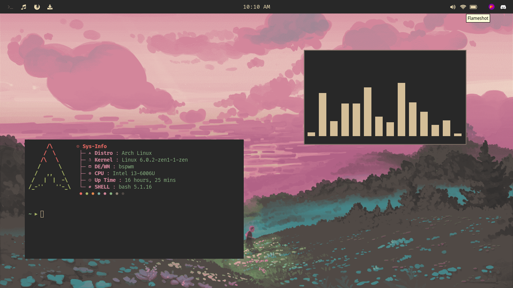

### Nix3l's .dotfiles

My dotfiles for my (currently) arch setup.
Made using the Nord color palette.
Made for simplicity and eyecandy.
Backgrounds in my backgrounds repo.

## Applications
    - Window Manager: BSPWM
    - Bar: Polybar
    - Editor: Neovim
    - Terminal: Alacritty
    - Web Browser: Librewolf
    - Pulseaudio Control Client: Pavucontrol
    - Application Launcher: Rofi
    - PDF/ePUB Reader: Zathura
    - File Manager: Thunar
    - Screenshot Utiliy: Flameshot
